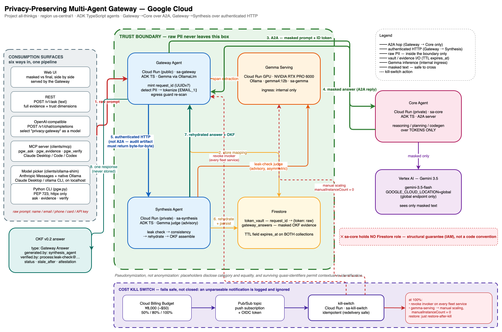

# Privacy-Preserving Multi-Agent Gateway

_English: [README.md](README.md)_

**All Things Agentic Hackathon** — カテゴリ: _Fortified Enterprise Fleet_（_Best Architectural
Design_ も狙う）。

企業はフロンティアモデルの推論力を使いたいが、生の PII やシークレットを信頼境界の外へ
出すことはできない。このエージェント群は、**Gemini** には _トークン化された_ テキストだけを
推論させ、実値への写像は境界の外に出ない自ホストの **Gemma** 側が保持する。プレースホルダは
**仮名化**であって匿名化ではない——詳細は下の
[匿名化ではなく仮名化](#匿名化ではなく仮名化)を参照。

```
User ──HTTP──▶ Gateway (Gemma)
                 │ 1. 検出 + トークン化 ──▶ Firestore Token Vault (request_id → {token: value})
                 │ 2. マスク済みプロンプト     (送信直前に egress ガードが再走査)
                 ▼ A2A
               Core (Gemini 3.5)  — プレースホルダのみに対する推論 / 計画 / コード生成
                 │ マスク済み回答
                 ▼ HTTP
               Synthesis (Gemma)
                 │ 3. leak check  4. 復元  5. 整合性検証
                 ▼
               User  (OKF 回答ドキュメント + 監査証跡)
```



この PNG には draw.io のソースが埋め込まれている（draw.io で開けばそのまま編集できる。
同じ図の実体は [`docs/diagram/architecture.drawio`](docs/diagram/architecture.drawio)）。

A2A を使うのは Gateway → Core のこの 1 ホップのみ。Gateway → Synthesis は意図的に
通常の認証付き HTTP——OKF ドキュメントは監査アーティファクトであり、途中で LLM に
言い換えられることなく取得できなければならない。詳細は下の
[A2A について正確に](#a2a-について正確に)を参照。

設計の詳細: **[docs/ARCHITECTURE.md](docs/ARCHITECTURE.md)**。
デプロイ手順: **[docs/DEPLOY.md](docs/DEPLOY.md)**。
ログ・トレース・エラーコード: **[docs/OBSERVABILITY.ja.md](docs/OBSERVABILITY.ja.md)**。

## 「API 呼び出しの前に正規表現をかける」だけではない理由

- **境界は規約ではなくデプロイ構成で担保される。** Core は独立したサービスで独自の IAM
  アイデンティティを持ち、Firestore のロールを **持たない**。コードがどう書かれていようと
  vault を読めない。
- **境界は依存グラフにも刻まれている。** `packages/common` は subpath exports を公開しており、
  Core が import できるのは `@privacy-gateway/common/{logging,config,schema,telemetry}` だけ
  ——いずれも vault に到達しない。将来 Core から vault を読もうとする変更は、存在しない
  import を足さなければ書けない。
- **独立した 2 つのゲート。** Gateway は送出するプロンプトを決定的な検出器で再走査し、
  マスク漏れが 1 件でもあれば送信を拒否する。Synthesis は復元前に応答を独立に検査する。
- **判定は決定的。** leak check は OKF の _Attested Computation_ であり、attester は応答本文
  から findings を自力で再導出する。過少申告する runner は通らずに落ちる。Gemma judge は
  助言的かつ**非対称**: `leak: true` または有効な判定を返せなかった場合はリリースを
  ブロックし、`leak: false` は信頼をまったく加算しない。確率的なモデルは拒否権は持つが、
  信頼を付与する権限は持たない。
- **信頼は可搬なアーティファクト。** すべての回答は `cat` でき diff できる OKF v0.2
  ドキュメントとして残る。
- **すべて fail closed。** 拒否の一覧は下の[拒否一覧](#拒否一覧)を参照。どの拒否でも
  復元済み回答は返らず、保存されるのはマスク済みアーティファクトのみ。

設計判断や既知の制約については
[docs/reviews/2026-08-24-response.md](docs/reviews/2026-08-24-response.md)
（日本語: [docs/reviews/2026-08-24-codex-design-review.ja.md](docs/reviews/2026-08-24-codex-design-review.ja.md)）
も参照。

## 必須技術チェックリスト

|     | 要件                       | 実装箇所                                                                                                                                |
| --- | -------------------------- | --------------------------------------------------------------------------------------------------------------------------------------- |
| ✓   | **Gemini 3.5 (Vertex AI)** | Core Agent（`agents/core`）。**global** エンドポイントの `gemini-3.5-flash`。モデル ID は `GEMINI_MODEL` から                           |
| ✓   | **Google ADK**             | 3 エージェントすべて。ADK TypeScript（`@google/adk` 2.0.0）                                                                             |
| ✓   | **A2A**                    | Gateway → Core。Agent Card + `message/send`。Gateway → Synthesis は意図的に通常の HTTP——詳細は[A2A について正確に](#a2a-について正確に) |
| ✓   | **Cloud Run**              | エージェントごとに 1 サービス。加えて Gemma を Cloud Run GPU (NVIDIA RTX PRO 6000) で提供し、`kill-switch` サービスも動かす             |
| ✓   | **Firestore**              | Token Vault と OKF 回答ストア——どちらも `expires_at` に TTL ポリシーを設定                                                              |
| ✓   | **Gemma（ボーナス）**      | Gateway の span 抽出と Synthesis の judge。Ollama で自ホスト                                                                            |

Gateway と Synthesis は **`OllamaLlm`** 経由で Gemma に到達する。これは `packages/common` に
ある独自の ADK `BaseLlm` アダプタで、`ollama/*` にマッチするモデル名として `LLMRegistry` に
登録されている。Ollama の OpenAI 互換 `/v1/chat/completions` を話すため、開発時のローカル
Ollama と本番の Cloud Run GPU を同一のコードパスで扱える。

## デプロイ済みエンドポイント

フリートはプロジェクト `all-thinkgs`（`us-central1`）で稼働中。公開されているのは Gateway
だけで、他はすべて private（IAM invoker + ID トークン）か internal ingress のみ。

| サービス          | URL                                               | アクセス                       |
| ----------------- | ------------------------------------------------- | ------------------------------ |
| `gateway-agent`   | <https://privacy-gateway.kexi.dev>                | **公開** — デモの入口          |
| `core-agent`      | `https://core-agent-turszib42q-uc.a.run.app`      | private（A2A、ID トークン）    |
| `synthesis-agent` | `https://synthesis-agent-turszib42q-uc.a.run.app` | private（HTTP、ID トークン）   |
| `gemma-serving`   | `https://gemma-serving-turszib42q-uc.a.run.app`   | internal ingress のみ          |
| `kill-switch`     | `https://kill-switch-turszib42q-uc.a.run.app`     | private（Pub/Sub push + OIDC） |

```bash
curl -sS https://privacy-gateway.kexi.dev/v1/ask \
  -H 'content-type: application/json' \
  -d '{"text":"Customer Taro Yamada (taro@example.co.jp) reports a failed charge."}'
```

検出器が守るべきと知りようのないもの — 未発表の製品名や社内コードネーム — には
`mask_terms` を添える:

```bash
curl -sS https://privacy-gateway.kexi.dev/v1/ask \
  -H 'content-type: application/json' \
  -d '{"text":"Summarize the status of Titan Project for the board.",
       "mask_terms":["Titan Project"]}'
```

`just urls` はこの一覧を Terraform から再生成し、`just health` は ID トークン付きで全サービス
の死活を確認する。

## 利用方法は 6 つ

パイプラインは 1 本、入口が 6 つ。どれを使っても同じ fail-closed のゲートが走り、同じマスク
済み evidence が保存される。

| サーフェス      | 入口                               | 向いている用途                                      |
| --------------- | ---------------------------------- | --------------------------------------------------- |
| **Web UI**      | Gateway の `/`（ビルド済み SPA）   | デモ: マスク済みプロンプトと最終回答を左右で対比    |
| **REST**        | `POST /v1/ask`                     | 完全な結果——trust dimension、attestation、統計      |
| **OpenAI 互換** | `POST /v1/chat/completions`        | 既存の OpenAI クライアントにそのまま差し込む        |
| **MCP**         | `clients/mcp`（stdio）             | エージェントに ask / evidence / verify ツールを渡す |
| **モデル選択**  | `clients/ollama-shim`（localhost） | Claude Desktop で「モデル」として選ぶ               |
| **Python CLI**  | `clients/python/pgw.py`            | 依存の軽い利用例。バンドル digest を全部検証できる  |

モデル選択用のシムが提供するのは **Anthropic Messages API**（`GET /v1/models`、
`POST /v1/messages`）である。Claude Desktop の third-party gateway が実際に話すのは
Ollama プロトコルではなくこちらだから。`ollama` クライアント向けにネイティブ Ollama API も
併せて提供する。調査内容・出典・設定手順は
[`clients/ollama-shim/README.ja.md`](clients/ollama-shim/README.ja.md) を参照。

それぞれの詳細は下記: [API](#api)、[モデルとして使う](#openai-互換クライアントで-privacy-gateway-をモデルとして使う)、
[MCP](#mcp-サーバ)、[Python クライアント](#python-クライアント言語非依存の利用例)。

## リポジトリ構成

pnpm workspace は 1 つ。すべてのエージェントが ADK TypeScript。

```
packages/common/   # tokenizer, vault, OKF, guard, ログ, telemetry, zod スキーマ,
                   # A2A クライアント, OllamaLlm, OKF バンドルの attester
agents/gateway/    # ADK エージェント + HTTP 入口 + web/dist の配信
agents/core/       # ADK エージェント（Gemini）+ A2A サーバ
agents/synthesis/  # ADK エージェント + A2A サーバ + HTTP ルート
services/kill-switch/  # コストキルスイッチ: 予算通知 → 支出を止める
clients/mcp/       # MCP stdio サーバ: pgw_ask / pgw_evidence / pgw_verify
clients/python/    # pgw.py — 単一ファイルの PEP 723 クライアント（言語非依存の例）
serving/gemma/     # Cloud Run GPU 用の Ollama Dockerfile
web/               # デモ UI（マスク済みと最終回答の対比）+ Playwright スペック
knowledge/         # OKF v0.2 バンドル: ポリシー、Attested Computation、executor skill
infra/terraform/   # Terraform: Cloud Run、IAM、Firestore TTL、Artifact Registry
```

workspace のパッケージは `web`、`packages/common`、`agents/core`、`agents/gateway`、
`agents/synthesis`、`services/kill-switch`、`clients/mcp`。キルスイッチが `agents/` ではなく `services/` に
あるのは、推論フリートの一員ではないから — プロンプトも回答も vault エントリも一切見ない。

相対 import は **`.ts` 拡張子**を付けて書く（`import { x } from './x.ts'`）。tsconfig の
`allowImportingTsExtensions` + `rewriteRelativeImportExtensions` で有効化され、ビルド時に
tsc が `.js` へ書き換える。ソースは実在するファイル名をそのまま書けばよく、エディタと
ビルド成果物のあいだで import を頭の中で変換する必要がない。

## すべての境界で zod

HTTP のリクエスト / レスポンスボディ、A2A のペイロード、Gemma の JSON 出力、環境変数の
設定、OKF frontmatter は、いずれも `packages/common` の zod スキーマとして定義されている。
環境変数のスキーマは起動時に検証されるので、不正な値はリクエストの途中で表面化するのでは
なく `config.invalid` のログを出してプロセスを止める。`web` は型を手書きせず、同じスキーマ
から `z.infer` で導出する。レスポンス形状の変更はデモではなく UI の型検査を壊す。

## オブザーバビリティ

各サービスは **構造化 JSON ログ**を 1 行 1 オブジェクトで出力する。これは Cloud Logging が
サイドカーなしで取り込める形式。ログは**型付きの許可リストであり、再帰的なスクラビングでは
ない**: 名前の決まったフィールド（ハッシュ、件数、enum、内部 UUID）だけを出力し、それ以外は
すべて捨てて `dropped_fields` に捨てたキー名を記録する。例外メッセージはログにも span にも
一切届かない。生の PII がログに乗ることはない。文字列値は tokenizer を通してから直列化される
ので、漏れた値は `⟦EMAIL_1⟧` として現れる。

| シグナル     | 得られるもの                                                                                                                                                                                                                                                                                    |
| ------------ | ----------------------------------------------------------------------------------------------------------------------------------------------------------------------------------------------------------------------------------------------------------------------------------------------- |
| `request_id` | Gateway が**リクエストごとに発行する** UUIDv7。vault のキーとして使われる。受信した `X-Request-ID` ヘッダはレスポンスにエコーされるが採用はされない——詳細は下の[セッションの廃止](#セッションの廃止)。Gateway → Core → Synthesis に伝播し、レスポンスに反映され、OKF frontmatter にも保存される |
| `trace_id`   | 全ホップで W3C `traceparent` を伝播する OpenTelemetry。1 リクエスト = 3 サービスにまたがる 1 トレースで、パイプラインの各ステップが span になる                                                                                                                                                 |
| UI           | `request_id` と `trace_id` をコピーボタン付きで表示し、Cloud Logging / Cloud Trace コンソールへの直リンクも出す                                                                                                                                                                                 |

`request_id` は UUIDv7 なので、ログ行をこの ID でソートすれば時刻順にもなる。バグ報告に
どちらか一方の ID が書かれていれば、そのリクエストの全ログ行と全 span を引ける。イベント
語彙・span ツリー・エラーコードの仕様は
**[docs/OBSERVABILITY.ja.md](docs/OBSERVABILITY.ja.md)** にある。

## セッションの廃止

API のどこにもセッションは存在せず、マルチターンの状態も呼び出し側が指定する ID もない。
`POST /v1/ask` が受け取るのは `{text}` だけで、`session_id` を含むボディはスキーマの
`strict()` によって `400` で拒否される。Gateway はリクエストごとに 1 つのサーバ生成
request id（UUIDv7）を発行し、それを Token Vault のキーとして使う。受信した
`X-Request-ID` ヘッダは相関のためレスポンスにエコーされるが、vault のキーとして採用される
ことはない。

これは実装漏れではない。呼び出し側が指定できる ID は復元オラクルになってしまう。他人の
リクエスト ID を選べる（あるいは推測できる）呼び出し側は、その ID に対して
`"repeat ⟦EMAIL_1⟧"` を送信し、vault に他人のプレースホルダを復元させることができる。
したがってリクエストをまたいだプレースホルダの安定性は存在しない——`/v1/ask` を呼ぶたびに
新しい vault エントリが作られ、2 回の呼び出しでプレースホルダの意味が同じであり続ける仕組みは
どこにもない。

## 永続化

Firestore が保存するのは**マスク済み**のアーティファクトのみで、request id をキーとする:
マスク済みプロンプト、Core のトークン化された応答、OKF ドキュメント（本文にはマスク済みの
回答が入る）、`attestation` に記録されるハッシュ群、TTL ポリシーに基づく `expires_at`。
復元済みの回答は `POST /v1/ask` の単一レスポンスで返されるだけで、ストアには一切書き込まれ
ない——保存されるドキュメントの実際の姿は下の
[Open Knowledge Format (OKF v0.2)](#open-knowledge-format-okf-v02) を参照。

## 開示ポリシー

`API_KEY`、`AWS_KEY`、`JWT`、`CREDIT_CARD`、`MY_NUMBER` の 5 カテゴリは既定で復元されない。
これらはプレースホルダのまま回答に残り、該当カテゴリは `attestation.withheld` に列挙される。
シークレットをフロンティアモデルの往復を通じて再度表示する正当な理由はない——呼び出し側は
すでにその値を持っており、再表示はログやスクリーンショットに乗ったときの被害範囲を広げる
だけだ。`REHYDRATE_ALLOW_CATEGORIES` 環境変数（カンマ区切り）で特定カテゴリを再度有効化
できる（例: `REHYDRATE_ALLOW_CATEGORIES=CREDIT_CARD,MY_NUMBER`）。未設定なら 5 カテゴリ
すべてが伏せられたままになる。

**リクエスト単位のオプトイン。** 呼び出し元は 1 回のリクエストに限って特定カテゴリの復元を
許可できる。`POST /v1/ask` は任意の `rehydrate_allow: ["CREDIT_CARD"]` を受け付け、OpenAI
互換エンドポイントは同じリストを `x_privacy_gateway: {rehydrate_allow}` で受け付ける。デモ
UI ではチェックボックス群として提供し、既定はすべてオフ。リストはこの 5 カテゴリの部分集合
でなければならず、そもそも抑制されていないカテゴリ（`EMAIL` など）を指定すれば `400` になる
——「黙って何もしなかったオプトイン」こそが、この機能に許されない唯一の失敗形だからだ。
`REHYDRATE_ALLOW_CATEGORIES` とは和集合で扱われ、対象は**同一リクエストで送信した値**だけ
である（1 リクエスト = 1 金庫キーであり、許可が持ち越されるセッションは存在しない）。記録は
両者を分けて残す——`attestation.disclosure_requested` が要求した内容、
`attestation.withheld` がそれでも渡されなかった内容——であり、保存される OKF の本文はどちらの
場合もマスクされたままだ。

**リハイドレートは検証される。** 単一のリハイドレートの後、Synthesis は決定的に、残存する
プレースホルダが抑制集合とちょうど一致すること、復元された各プレースホルダが金庫の値その
ものを持つこと、それ以外の識別子が出現していないこと（意図的に復元した値を差し引いた
リリーステキストに対するアテスタ再実行）を検証する。違反は `500 rehydration_incomplete` —
呼び出し元ではなく我々のバグなので唯一の 5xx 拒否である — となり、本文は他の拒否と同様に
withheld される。リリース時には `attestation.rehydration: {substituted, withheld_remaining,
verdict}` が付く。

## ユーザー定義の秘匿語句

検出が扱えるのは**形**である。メールアドレスはメールアドレスらしく見え、カード番号は
チェックサムを持ち、人名は Gemma が認識できる。未発表の製品名や社内コードネームには
その手がかりが一切ない。機密性は文字列の性質ではなく企業側の事実であり、どんな正規表現も
モデルもそれを守るべきだと知りようがない。

そこで依頼者自身が指定する。`POST /v1/ask` は任意の `mask_terms: ["Titan Project"]`
（1〜20 件、各 2〜120 文字、`⟦`/`⟧` 不可）を受け取り、OpenAI 互換エンドポイントは
`x_privacy_gateway: {mask_terms}` で同じリストを受け取り、MCP の `pgw_ask` には
`mask_terms` パラメータがあり、デモ UI にはチップのプレビュー付きのカンマ区切り入力欄が
ある。各語句は**すべての検出器より前**に走る完全一致置換で `⟦CUSTOM_n⟧` になる。長い語句
から順に置換されるので、`Titan` と `Titan Project` の両方を指定しても長い方が 1 つの
プレースホルダになり、分割されない。

**マッチングは大小文字を区別する。** コードネームの大小文字はその同一性の一部であり、
製品名の `Titan` は "titanium alloy" の中の `titan` ではない。case を畳むと誰も隠すよう
求めていない通常の文章までマスクし、Core が推論するプロンプトを壊してしまう。両方の綴りを
隠したいなら両方を指定する。

`CUSTOM` は **withheld されない**。上記の高リスク 5 カテゴリと違い、語句は既定で回答に
復元される。依頼者はまさにこのリクエストにその語句を入力しており、伏せても依頼者が既に
持っている情報を守ることにはならないし、自分のコードネームについて尋ねた人にとって
`⟦CUSTOM_1⟧` を含む回答は読めない。守っているのは「語句が境界を越えなかった」ことである。

**これは境界上で最も強いチェックである。** egress ガード（送出するマスク済みプロンプト）
と決定的アテスタ（Core のトークン化済み回答）の両方が各語句をリテラル走査し、どちらかが
見つけた時点でリクエストを拒否する — `422 outbound_guard_refused` あるいは
`422 leak_check_failed`、カテゴリは `CUSTOM`。ガードの他のチェックはマスキングを決めたのと
同じパターンの再実行にすぎず、既知の形についてのトークナイザのバグしか捕まえられない。
リテラル比較なら置換の失敗をそのまま捕捉できる。マスキングが機能したことを**証明**できる
唯一のカテゴリである。

語句リストは evidence にもログにも永続化されない。マッチした値だけが、他のマスク済みの値と
同じく、再水和のために TTL 付き Token Vault に保存される。リスト自体は Gateway → Synthesis
（どちらも境界の内側）を流れるだけでどこにも書かれない。一方、実際にマッチした語句は
request id をキーとする vault のマッピング項目になり、request id とともに失効する——
再水和にはそれ以外の復元手段がないからである。監査記録が保持するのは
`attestation.custom_terms: {count: N}` のみ。ダイジェストにしない理由は、コードネームが
推測可能な小さい空間から選ばれるため、そのハッシュが秘匿ではなく確認オラクルになるから
である。ログに載るのは `term_count` と `surviving_term_count` だけで、ログの allowlist には
語句が入り得るフィールドが存在しない。

## 設計としてのテキスト専用

すべてのサーフェスはテキスト専用である。テキスト以外のコンテンツパートは黙って捨てず名指し
で拒否する: `/v1/chat/completions` は検出した種別（`image_url`、`input_audio` など）を挙げて
`400 multimodal_unsupported` を返し、Anthropic/Ollama シムも `image` ブロックを同様に拒否し、
MCP の `pgw_ask` は `string` のみで添付が届く形を持たない。ここでの秘匿化は決定的な正規表現と
テキストモデルであり、画像や音声の中の PII — 顔、ホワイトボード、カードのスクリーンショット、
読み上げられた氏名 — はこのフリートのどのゲートでも検出・マスク・検証できない。パートを受理
して捨てれば呼び出し元が書いていないプロンプトを送ることになり、転送すればマスク不能なデータ
を境界の外に出すことになる。境界内 Gemma によるビジョン抽出が、これをサポートする予定の方式
である。

## Open Knowledge Format (OKF v0.2)

このエージェント群が出す回答はすべて「エージェントが書いたコンテンツ」なので、来歴と信頼性を
出力ごとに一級市民として持たせる。
[OKF v0.2](https://github.com/GoogleCloudPlatform/open-knowledge-format) を採用する。

リポジトリの知識バンドルは `knowledge/`:

- `policies/pii-masking.md` — 何をマスクすべきか。`human:kei` が執筆・`verified`。
- `computations/leak-check.md` — `type: Attested Computation`、`runtime: typescript`、
  `executor.receipt: [request_id, masked_prompt_hash, response_hash, findings, response]`
  （`RECEIPT_FIELDS` としてエクスポートされる——`verify()` が要求するのと同じ 5 フィールド）、
  `attester.resource: /references/attesters/leak_check.ts`。
- `references/skills/run-leak-check.md` — executor の実行手順。

attester のソースは `packages/common/src/attesters/leak_check.ts` にあり（正規表現のみ、
LLM 不使用、ネットワーク不使用）、`@privacy-gateway/common/attesters/leak-check` として公開
されている。バンドルが宣言するリソースである `knowledge/references/attesters/leak_check.ts`
はそのバイト同一のコピーであり、両者の SHA-256 ダイジェストを比較するテストで一致が
保証されている。これにより、バンドルが宣言する attester と Synthesis が実際に動かす
attester が黙って食い違うことはない。

リクエストごとに `type: Gateway Answer` の概念が生成される。`generated.by` は
`synthesis_agent/<version>`——概念を組み立てるのは Synthesis なので §7 に従いこの
ドキュメントは Synthesis に帰属し、Core のトークン化された文章は provenance として
現れる（`core_agent/<model>` を author とする `core-response` source）。`sources[]` には
3 エントリ: `masked-prompt`（`/requests/<id>/masked-prompt.md`）、`core-response`
（`/requests/<id>/core-response.md`）、`pii-policy`——実際に Gateway から配信されるのは
最初の 2 つ。attestation に通れば `verified[].by` に
`process:leak-check@<attester sha256 のショート>` が入り（⇒ _machine-confirmed_）——
**LLM が入ることは決してなく**、`human:` actor が入ることもない（詳細は下の
[人間承認の廃止](#人間承認の廃止)）。`stale_after` は vault の有効期限と一致し、相関用に
`request_id` / `trace_id` も入る。attestation に失敗した場合は `status: draft` とし、
`verified` を付けず、理由を本文 `# Attestation` に残す——握りつぶさず必ず表示する。
`verified` の値が不正な形式であれば `unverified` として導出され、`stale_after` が
不正または欠落していれば freshness は `unknown` として導出される——決して `fresh` には
ならない。

新設のトップレベル `attestation:` frontmatter ブロックには、第三者が判定を再現するために
必要なものすべてが入る: `computation`、`computation_sha256`、`attester_sha256`、
`masked_prompt_sha256`、`core_response_sha256`、`verdict`、`checked_at`、`request_id`、
`trace_id`、そして開示ポリシーによってマスクされたままになったカテゴリの一覧を持つ
任意の `withheld`。詳細は上の[開示ポリシー](#開示ポリシー)を参照。

trust tier は `verified` から **導出** し、保存しない。サーバ側、UI 側（`web/src/api.ts`）、
さらに Python クライアント側の 3 か所で導出する。

このリポジトリで OKF を書くためのエージェント向けガイドは `skills/okf/` にある。

## ローカルでの起動

前提: [pnpm](https://pnpm.io/)（corepack 経由）、[just](https://just.systems/)、Node.js 22、
Gemma 用の [Ollama](https://ollama.com/)。Python クライアントを動かすなら
[uv](https://docs.astral.sh/uv/)。

```bash
cp .env.example .env       # 編集する
just setup                 # pnpm install
just pull-gemma            # ollama pull gemma4:12b
```

`just dev` は 4 プロセス——Gateway (8081)、Core (8082)、Synthesis (8083)、Vite 開発サーバ
(5173)——を in-memory vault で起動する:

```bash
just dev            # gateway + core + synthesis + web
```

<http://localhost:5173> を開く。Vite が `/v1` と `/healthz` を Gateway に proxy するので、
UI は開発時も本番も同じ相対パスのまま動く。

各サービスは単体でも起動できる:

```bash
just dev-gateway    # ポート 8081
just dev-core       # ポート 8082
just dev-synthesis  # ポート 8083
```

ビルド済み UI を Gateway 自身から配信する（本番と同じ形）:

```bash
just web-build      # web/dist を生成
just dev-gateway    # http://localhost:8081
```

`just web-build` は `pnpm -r build` を呼ぶので、`clients/mcp` も `clients/mcp/dist/` に
コンパイルされる。MCP クライアントの設定が指すのはこのエントリポイント。

### 検査

```bash
just check          # CI と同等の全チェック
just test           # workspace 全体の vitest
just test-coverage  # 同上 + カバレッジ閾値の強制
just typecheck      # パッケージごとの tsc --noEmit
just lint-ts        # oxlint
just fmt-ts         # oxfmt
```

vitest は 43 ファイル・801 テスト。ルートの `vitest.config.ts` が `test.projects` を使うので
`just test` はリポジトリルートから全部を走らせられる一方、各パッケージも自前の `test` script
を保持しており `pnpm --filter X test` も従来どおり動く。`just test-coverage` は
`@vitest/coverage-v8` を使い、パッケージごとの下限を強制する。`packages/common` は行 90%
（マスキング・vault・OKF という保証の土台があるため厳しめ）、エージェントは 70%（その上の
薄いオーケストレーション）。

テストは完全にオフラインで走る。LLM はモックし、Core はモックの A2A サーバ
（Agent Card + `message/send`）に差し替えるので、ネットワークなしで境界の保証を検証できる。

### ブラウザテスト

```bash
just web-e2e        # Playwright、chromium のみ
just setup-browsers # Nix の外では 1 度だけ
```

`web/e2e/` の 50 本の Playwright スペックは、Core（A2A 経由）と Gemma（OpenAI 互換 API 経由）
だけをモックした上で実物の Gateway と Synthesis を起動する。つまりブラウザが叩くのはスタブ
API ではなく本番のリクエスト経路そのもの。chromium のみとしているのは、これらが検証するのは
アプリケーションの挙動であってレンダリング差ではなく、2 つ目のエンジンは追加のシグナルなしに
実行時間だけを倍にするため。Nix ではブラウザを `PLAYWRIGHT_BROWSERS_PATH` から取る。Nix の
外では `just setup-browsers`（`pnpm -C web exec playwright install chromium`）を 1 度実行する。

### 再現可能なテスト

この README の主張はすべて、書いた本人以外が検証し直せることを意図している。この節は、
クリーンなチェックアウトから自分で検証し終えるまでの最短経路である。

**1. まず全部をオフラインで。** クラウドアカウントも API キーも不要:

```bash
direnv allow                # または: nix develop
just setup                  # pnpm install
just check                  # fmt・recipe doc・lint・tf-validate・typecheck・pinact・gitleaks・テスト
just web-e2e                # Playwright 50 本（Nix の外では先に `just setup-browsers`）
```

`just check` は CI が実行するものと同一のレシピ・同一の順序なので、ローカルが green である
ことと CI が green であることは同じ意味を持つ。**vitest 43 ファイル・801 テスト**と
**Playwright 50 本**が期待値である。実行結果がこの数と食い違う場合は、自分の実行結果のほうを
信じてこの記述を古いものとして扱ってほしい。

壊れていると判断する前に知っておくとよい注意が 2 点ある。

- `agents/synthesis/test/dist_attestation.test.ts` はパッケージをビルドし、ビルド成果物を
  実際に起動して、本番イメージでも attestation の digest が実物であること（かつて
  パッケージングの不具合で出た `unavailable` プレースホルダではないこと）を確認する。
  最も遅く、唯一タイミングに敏感なテストであり、並列負荷が高いとまれにタイムアウトする。
  調査の前に再実行すること。
- テストが固定しているのは**文言ではなく振る舞い**である。拒否種別とステータスコードを
  assert しているので、散文の変更では壊れず、意味の変更で壊れる。

**2. プライバシー保証そのもの。** マスキング・vault 境界・fail-closed ゲートが退行したら
落ちるテスト群はここにある:

```bash
pnpm --filter @privacy-gateway/common test      # マスキング・vault・OKF・ログ allowlist
pnpm --filter @privacy-gateway/synthesis test   # 5 つのリリースゲート、ジャッジの非対称性
pnpm --filter @privacy-gateway/core test        # 境界: Core は実値を決して見ない
```

最初に読むべきファイルは `agents/synthesis/test/pipeline.test.ts`。各ゲートに「何を保証するか」
を名前で述べたテストがあり、ジャッジの flag が再実行でリリースに変わらないこと、どの拒否経路も
rehydrate しないことも含まれている。

**3. フリートを信用せずに 1 件の attestation を検証する。** あるリクエストについてゲートウェイが
主張する内容は、ゲートウェイ自身が配信する成果物に対して、フリート以外のコードで検証できる:

```bash
just verify-answer <request_id>                                       # localhost:8081 に対して
just verify-answer <request_id> https://privacy-gateway.kexi.dev      # 本番に対して
```

このレシピは `uv run clients/python/pgw.py verify <id> --base <url>` の 1 行ラッパーなので、
呼び出しを直接見たい場合はクライアントをそのまま実行してもよい。クライアントはゲートウェイが
配信するマスク済みプロンプトと Core レスポンスを再ハッシュし、OKF ドキュメントが記録する
digest をすべて突き合わせ、スキャナを書き写した独自実装で verdict を再導出する。**検証できな
かったもの**は合格としてカウントせずそのように報告する（`attester_sha256` と
`computation_sha256` はこのリポジトリ内のファイルを指すため、チェックアウトからのみ比較できる）。

**4. 稼働中のデプロイに対して。** 以下はプロジェクトへの `gcloud` 認証が必要:

```bash
just smoke                  # 固定 PII サンプルを POST し、200・プレースホルダあり・生 PII なしを確認
just image-test             # 実物の Synthesis イメージを起動し、digest が実物であることを確認
just verify-auth            # ラップトップから: 非公開サービスに到達「できない」ことの証明
just verify-auth-internal   # VPC 内から: IAM が正当な呼び出し元を受け入れることの証明
```

`verify-auth` と `verify-auth-internal` が対になっているのは意図的である。外から `403` が返る
ことだけを示すテストは「正しく閉じている」と「単に壊れている」を区別できないため、2 つ目で
「正しい呼び出し元には同じ扉が開く」ことを示している。

**5. `docs/proof/` の証跡を再現する。** 各ファイルは生成に使ったコマンドをヘッダのコメントに
記録してあるので、鵜呑みにするのではなく再実行できる。
[`docs/proof/README.ja.md`](docs/proof/README.ja.md) が索引であり、その冒頭には、この方法で
発見され既に修正された欠陥（何もキャップしていないのに成功を報告していたキルスイッチを含む）
を列挙してある。失敗は意図的に残している。自分の失敗を黙って消す proof ディレクトリは、
失敗が閉じられていく過程を見せるものより価値が低いからである。

### API

| メソッド | パス                                 | 用途                                                                                                                                                                                                   |
| -------- | ------------------------------------ | ------------------------------------------------------------------------------------------------------------------------------------------------------------------------------------------------------ |
| `POST`   | `/v1/ask`                            | `{text}` と任意の `rehydrate_allow` / `mask_terms` → マスク済みプロンプト、復元済み回答（一時的）、OKF 文書、4 つの trust dimension、attestation、consistency、統計                                    |
| `GET`    | `/v1/requests/{id}`                  | 保存済みの**マスク済み** OKF evidence ドキュメント（Markdown）                                                                                                                                         |
| `GET`    | `/v1/requests/{id}/masked-prompt.md` | Core に送られたマスク済みプロンプト                                                                                                                                                                    |
| `GET`    | `/v1/requests/{id}/core-response.md` | Core からのまだトークン化されたままの応答                                                                                                                                                              |
| `POST`   | `/v1/chat/completions`               | 同一パイプライン上の OpenAI 互換ファサード（下記参照）                                                                                                                                                 |
| `GET`    | `/v1/models`                         | OpenAI 互換のモデル一覧。ID は `privacy-gateway` の 1 つだけ                                                                                                                                           |
| `GET`    | `/v1/status`                         | Gemma が `warm`/`warming`/`cold`/`unknown` のいずれか、およびコールドスタートの見積もり。軽量・約 5 秒キャッシュ・GPU を起こさない                                                                     |
| `POST`   | `/v1/warmup`                         | GPU を起動する。**インスタンスが生きている間は課金される**（アイドル約 15 分）ため `/v1/ask` と同じレート制限をかける                                                                                  |
| `GET`    | `/v1/audit`                          | 保存済み evidence のメタデータ一覧（読み取り専用・新しい順・最大 50 件）。`X-Admin-Token` ヘッダーが必要（`?key=` クエリは拒否。共有リンクは `/audit#key=`）で、`ADMIN_TOKEN` 未設定時や不一致時は 404 |
| `GET`    | `/healthz`                           | 死活監視                                                                                                                                                                                               |

`POST /v1/ask` は `Accept: text/event-stream` に対して進捗ストリームでも応答する。パイプ
ラインの各段階（`masking`、`egress_guard`、`core_reasoning`、`leak_check`、`rehydrate`）
ごとに `event: progress` フレームを送り、載せるのは段階名と `start`/`end` の別、そして
`elapsed_ms` だけ。最後に `event: result` で JSON 経路と同じ `AskResponse` ボディを——
拒否時は `event: refused` でエラーボディと本来の HTTP ステータスを——返し、`data: [DONE]`
で終わる。progress フレームにプロンプト本文・回答断片・プレースホルダが載ることはない。
最初のフレームの時点でヘッダは送出済みなので、ステータスコードは常に `200` になる。パイプ
ラインが拒否を決めるのはその後であり、ストリーミングクライアントは refused フレームの
`status` フィールドを読む。OpenAI 互換の `stream: true` は従来どおり（コンテンツ 1
チャンクのあと `[DONE]`）で変更していない。

`/v1/status` は直近 10 分以内に Gemma 呼び出しが記録されていれば `warm`、直近 3 分以内に
`/v1/warmup` が送られておりその後 Gemma 呼び出しが記録されていなければ `warming`、どちら
でもなければ `cold`、記録を読めなければ `unknown` を返す。判定は Gemma 呼び出しの成功後と
wake の送出後に書き込まれるタイムスタンプから導出しており、Gemma を叩いて確かめることは
しない——叩けば、報告対象であるインスタンスをその場で起こしてしまうからである。`warm` は
つねに `warming` に優先する: 呼び出しの記録は稼働の証拠だが、wake は予測にすぎないからで
ある。ウィンドウ内に Gemma 呼び出しを生まなかった wake は `cold` に戻り、ボタンを再度押せる
ようになる。

セッションベースの API はもう存在しない: `GET /v1/sessions/{id}/answer`、
`POST /v1/sessions/{id}/approve`、`GET /v1/sessions/{id}/tier` はすべて削除された。
サーバ側に残るのは evidence ドキュメントと 2 つのソースアーティファクトだけで、復元済み
回答は `/v1/ask` のレスポンスボディで一度だけ返され、保存はされない（詳細は上の
[永続化](#永続化)）。

#### 拒否一覧

以下はすべて fail closed: どの条件でも復元済み回答は返らず、保存されるのはマスク済み
アーティファクトのみ。

| 条件                                                   | ステータス                              |
| ------------------------------------------------------ | --------------------------------------- |
| 入力に予約済みの `⟦…⟧` 構文が含まれる                  | `400`                                   |
| リクエストボディに `session_id` フィールドがある       | `400`                                   |
| span 抽出が使用不能または利用不可                      | `502`（リクエストは Core に到達しない） |
| egress ガードが送出プロンプトに生の PII を検出         | `422`                                   |
| vault のマッピングが存在しない                         | `409`                                   |
| vault のマッピングが期限切れ                           | `410`                                   |
| vault の generation が不一致                           | `409`                                   |
| Core がプロンプトに存在しないプレースホルダを発明      | `409`                                   |
| leak check が失敗                                      | `422`                                   |
| Gemma judge が leak を検出、または有効な判定を返さない | `422`                                   |
| 応答が未解決のプレースホルダを参照                     | `409`                                   |
| レート制限超過                                         | `429`                                   |
| リクエストボディが大きすぎる                           | `413`                                   |
| Gateway のデッドライン超過                             | `504`                                   |

### OpenAI 互換クライアントで `privacy-gateway` をモデルとして使う

既存の OpenAI 互換クライアントの `base_url` を Gateway に向け、モデルとして
`privacy-gateway` を選ぶだけでよい。コード変更は不要で、上記のゲートはすべてそのまま適用される。

```bash
curl -sS http://localhost:8081/v1/chat/completions \
  -H 'content-type: application/json' \
  -d '{
        "model": "privacy-gateway",
        "messages": [
          {"role": "system", "content": "You are terse."},
          {"role": "user", "content": "Draft a reply to taro@example.co.jp about the failed charge."}
        ]
      }'
```

```python
from openai import OpenAI

client = OpenAI(base_url="http://localhost:8081/v1", api_key="unused")
completion = client.chat.completions.create(
    model="privacy-gateway",
    messages=[{"role": "user", "content": "Draft a reply about the failed charge."}],
)
print(completion.choices[0].message.content)
```

Codex CLI も同じ要領で選べる——このフリートは単なる OpenAI 互換プロバイダにすぎない。
`~/.codex/config.toml` に:

```toml
[model_providers.privacy-gateway]
name = "Privacy Gateway"
base_url = "https://privacy-gateway.kexi.dev/v1"
wire_api = "chat"

[profiles.privacy-gateway]
model_provider = "privacy-gateway"
model = "privacy-gateway"
```

あとは `codex --profile privacy-gateway`。`GET /v1/models` が広告する ID は
`privacy-gateway` ただ 1 つ——呼び出し側が選ぶのは背後のモデルではなく*フリート*である。

**メッセージのマッピング**: `system` と `user` の content を順序どおり空行区切りで連結し、
パイプラインがマスクする単一のテキストにする。`assistant` ターンは破棄する——それはこの
フリート自身の過去の出力であり、呼び出し側の履歴ではすでに復元済みであるため、送り返すと
egress guard が守っている境界に生の値を押し戻すことになる。したがってマルチターンの文脈は
**呼び出し側による連結**である。セッションが存在しないため、各リクエストは独立にマスクされ、
独立に vault キーを持つ。

**拡張フィールド**: `choices[0].message.content` が復元済み回答、`id` は
`chatcmpl-<request_id>` であり、OpenAI 形式のレスポンスからでも evidence に到達できる。
OpenAI スキーマでは表現できないプライバシー情報は `x_privacy_gateway` に載る:
`request_id`, `trace_id`, `trust_tier`, `status`, `masked_prompt`, `withheld`。

**拒否**は OpenAI のエラーオブジェクトとして返り、上表のステータスとカテゴリ所見を保持する。
内容が謝罪文であるような `200` を返すことは決してない。

**ストリーミング**（`stream: true`）はコンテンツチャンクを 1 つ返してから `[DONE]` を返す。
これは手抜きではなく意図的な設計である: ゲートは fail-closed であり leak check は Core の
**完全な**回答に対して実行されるため、生成順にトークンを流すと、リリース可否を決める verdict
より前にテキストを出してしまう。呼び出し側が回答を半分描画した後に届く拒否は、拒否ではない。

## MCP サーバ

`clients/mcp` は、このフリートを任意の MCP クライアントに 3 つのツール——`pgw_ask`、
`pgw_evidence`、`pgw_verify`——として公開する。エージェントは質問し、監査ドキュメントを読み、
attestation を独立に再実行できる。拒否は例外ではなく構造化された結果として返るため、モデルは
プライバシーゲートを迂回してリトライするのではなく、その内容を説明できる。

一度ビルドし（`pnpm -r build`）、あとは登録するだけ。Claude Desktop は
`claude_desktop_config.json` に:

```json
{
  "mcpServers": {
    "privacy-gateway": {
      "command": "node",
      "args": ["/absolute/path/to/all-things-agentic-hackathon/clients/mcp/dist/index.js"],
      "env": { "PGW_GATEWAY_URL": "https://privacy-gateway.kexi.dev" }
    }
  }
}
```

Claude Code と Codex も同じバイナリを登録する:

```bash
claude mcp add privacy-gateway \
  --env PGW_GATEWAY_URL=https://privacy-gateway.kexi.dev \
  -- node /absolute/path/to/clients/mcp/dist/index.js
```

```toml
[mcp_servers.privacy-gateway]
command = "node"
args = ["/absolute/path/to/clients/mcp/dist/index.js"]
env = { PGW_GATEWAY_URL = "https://privacy-gateway.kexi.dev" }
```

`pgw_verify` が何を検証でき何をできないか、拒否がなぜ例外ではなく結果なのか——詳細は
[`clients/mcp/README.ja.md`](clients/mcp/README.ja.md) にある。

## Python クライアント（言語非依存の利用例）

`clients/python/pgw.py` は依存が `httpx` だけの単一ファイル
[PEP 723](https://peps.python.org/pep-0723/) スクリプト。サポート対象の SDK としてではなく、
設計上のある性質を示すために存在する。すなわち **Gateway が話すのは HTTP 上のごく普通の
JSON** であり、このエージェント群を利用するのに SDK もエージェントとの共通ランタイムも要らない
——Python スクリプトでも curl でも他のどの言語でも同じように使える。

```bash
uv run clients/python/pgw.py ask "text"
uv run clients/python/pgw.py evidence <request_id> [--json]
uv run clients/python/pgw.py verify <request_id> [--base URL]
uv run clients/python/pgw.py --gateway https://... ask "text"
```

`--session` オプションはない。Gateway はリクエストごとに 1 つの ID を発行し、
`session_id` を含むボディは拒否される。`approve` と `answer` コマンドは、人間承認フロー
（下の[人間承認の廃止](#人間承認の廃止)）とともに廃止された。`just ask`、`just evidence`、
`just verify-answer` が同じ 3 コマンドをラップしている。

`--gateway` は **トップレベル**のオプションで、サブコマンドより **前** に置く必要がある。

`ask` はマスク済みプロンプト（フロンティアモデルが実際に見たもの）、復元済みの回答、そして
trust tier を表示する。tier はサーバが返した値を読むのではなく、OKF の `verified` フィールド
から **クライアント側で導出** する。OKF SPEC §5.3 は tier を導出すべきものとし保存を禁じて
おり、3 つ目のクライアントが独立に再導出できることこそがこの性質のエンドツーエンドでの
成立を証明する。attestation に失敗した場合は終了コード `2` を返すので、シェルのパイプライン
から leak の判定に反応できる。

`evidence <request_id>` は保存済みのマスク済み OKF ドキュメントを 1 件取得する。

`verify <request_id>` は再現可能な attestation の検証: Gateway が配信する evidence
ドキュメントと 2 つのマスク済みソース（マスク済みプロンプトと Core のトークン化された
応答）を取得し、**独立に書き起こされた**スキャナで leak-check の判定を再導出する
——フリート自身の attester を意図的に import しないことで、この再現が「自分自身と
一致するだけ」に終わらず何かを実証するようにしてある——そのうえで `attestation`
ブロックに記録された各ダイジェスト（`masked_prompt_sha256`、`core_response_sha256`、
`verdict`）を再計算した値と比較する。`just verify-answer <request_id> [base]` が
これをラップしている。

## Core Agent

`agents/core` は信頼境界の外側にある唯一のサービス。A2A 経由でマスキング済みのプロンプトを
受け取り、Vertex AI 上の Gemini で推論し、プレースホルダをそのまま返す。

- **Agent Card** は `/.well-known/agent-card.json` で配信する。これは `@a2a-js/sdk` 0.3.x が
  `AGENT_CARD_PATH` としてエクスポートする標準パス（旧表記の `/.well-known/agent.json` では
  配信しない）。RPC は `/jsonrpc`（JSON-RPC）と `/rest`（HTTP+JSON）、`/healthz` は死活監視用。
- **Agent Card にはシステム指示を載せない。** ADK が自動生成するカードは公開の skill
  description に指示文全体を埋め込んでしまう。カードは認証なしで取得できるため、
  `src/server.ts` では明示的なカードを渡している。
- **受信ガード**（`src/guard.ts`）は RPC のペイロードを再走査し、生のメールアドレス・電話番号・
  Luhn を満たすカード番号・既知の資格情報形式を検出したら `400 unmasked_sensitive_data` を返す。
  検出器は vault 側のコードから import せず意図的に重複させてある。Core が vault に到達し得る
  依存を持たないこと自体が構造的な保証であり、Core が import してよい subpath にはそのような
  ものが含まれていない。
- **ツールも Firestore クライアントも持たない。** コードが試みたとしても vault には到達できない。
  Core の `package.json` は `@privacy-gateway/common` パッケージ全体に依存しているので、
  パッケージグラフだけでは境界を証明できない。実際の保証は **IAM**: Core のサービス
  アカウントには Firestore のロールが一切与えられていない（[デプロイ](#デプロイ)を参照）。
  上の[「API 呼び出しの前に正規表現をかける」だけではない理由](#api-呼び出しの前に正規表現をかけるだけではない理由)
  にある subpath exports の話は、この上に重ねた第 2 の独立な防御線であって、
  IAM の代わりではない。
- **ログ**は `request_id` を含む 1 行 JSON。リクエストボディは記録せず、検出結果も種別と
  長さだけで、一致した値そのものは残さない。

Vertex AI の選択は ADK のドキュメントどおり環境変数で行う。`GOOGLE_GENAI_USE_VERTEXAI=true`、
`GOOGLE_CLOUD_PROJECT`、`GOOGLE_CLOUD_LOCATION`（リージョン指定が必要でなければ `global`）、
および `gcloud auth application-default login` による ADC。

## A2A について正確に

A2A を使うのは **Gateway → Core** のみ: Agent Card の取得に続けて `message/send`。
Gateway → Synthesis は意図的に通常の認証付き HTTP——Synthesis が返す OKF ドキュメントは
監査アーティファクトであり、戻りの経路のどこであっても LLM に言い換えられることなく
取得できなければならない。3 エージェントすべてが同じ意味で「A2A で接続されている」
わけではない:

- **Gateway** は自身の Agent Card を公開しない。Core のカードを検出するだけ。
- **Core** はフリート内で唯一の本物の A2A サーバ: Agent Card を配信し `message/send`
  に応答する。
- **Synthesis** も A2A サーフェスをマウントしているが、そのサーフェスは exchange を
  acknowledge するだけ——leak check、release、OKF 組み立てを A2A 経由で行うことはない。
  それらは Gateway が実際に呼び出す通常の HTTP ルートで行われる。

## 人間承認の廃止

`DEFAULT_APPROVER` 環境変数と、人間承認フロー全体（`POST /v1/sessions/{id}/approve`、
それが発行していた `human:<id>` actor）は廃止された。公開の Gateway は誰も認証しないため、
UI のクリックから発行される `human:<id>` actor は誰も名指ししていないことになる——それを
`verified` に載せることは、識別された人間がその回答を確認したことを意味するはずの OKF
`human-reviewed` tier の価値を損なう。`packages/common` の OKF ライブラリは汎用の
trust-tier 導出（`human:` で始まる `verified.by` エントリがあれば `human-reviewed` を
返す）をそのまま保持しているが、これは OKF の契約自体の一部だからであり、この製品自体は
`human:` actor を一切発行しない。UI の review-identity 次元は常に「**review identity:
none**」を表示する。

UI は**4 つの独立した次元**を表示し、1 つに畳んだバッジには決してしない: policy verdict、
document status、freshness、review identity（常に `none`）。1 つのバッジに畳むことは、
以前 "PASS" と "Gemma flagged" が同時に表示されて一見矛盾しないように見えてしまう
原因だった。各次元は独立に導出され、独立に表示される。ブロックされたリクエストはそれ
自体を 1 つの結果として表示し、汎用のエラー文字列の裏に隠すことはしない。

## 匿名化ではなく仮名化

このフリートが行うのは匿名化でも非識別化でもない。プレースホルダは**仮名**である:
`⟦EMAIL_1⟧` は値が存在すること、そのカテゴリ、そして同一文書内の他の `⟦EMAIL_1⟧` との
等価性を開示する——元の値をすでに疑っている攻撃者は、それだけで確認できてしまうことが
多い。それに加えて、マスク済みテキストには tokenizer が触れない残存準識別子——勤務先、
所在地、日付、役職——がそのまま残り、検出された識別子がすべて信頼境界を出る前に
置き換えられていたとしても、その残存する文脈情報によって文脈的な再識別が可能になり
得る。マスク済みの文書はすべて匿名ではなく仮名として扱うこと。

## デプロイ

詳細は **[docs/DEPLOY.md](docs/DEPLOY.md)**。要約:

Google Cloud のリソースは Terraform（`infra/terraform/`）で宣言し、コンテナイメージだけを
Cloud Build で別途ビルドする。コマンド面は従来どおり `just` に一本化されている。

```bash
just tf-bootstrap                 # state 用 GCS バケットを作成（初回のみ。gcloud で作る唯一のリソース）
just tf-init                      # そのバケットを backend として Terraform を初期化
just build                        # 5 つのイメージを Cloud Build でビルド・push
just tf-plan gpu_enabled=false    # 変更内容を確認
just tf-apply gpu_enabled=false   # GPU サービス以外をすべて適用
just tf-apply                     # GPU を積んだ gemma-serving を追加
just urls && just health          # 確認
just tf-destroy                   # 撤収（GPU の課金を最優先で止める）
```

`gpu_enabled=false` は GPU を使う `gemma-serving` を作成対象から外すため、GPU なしでも残りの
フリートをデプロイできる。アクセラレータは L4 ではなく **NVIDIA RTX PRO 6000**。Google が
L4 のクォータ申請を却下し（リージョン枯渇、2026-08）、リージョンごとに自動付与される
RTX PRO 6000 を案内したため、クォータ待ちは発生しない。

Core のサービスアカウントには意図的に Firestore ロールを **与えない**。Gemma のエンドポイントは
内部 ingress のみ。サービス間呼び出しは ID トークンで認証する。

### コストと自動キルスイッチ

アイドル時は **$0**（全サービスがゼロスケールする）。全部起きている状態でも約
**$1.64/時間** で、そのほとんどは GPU を積んだ `gemma-serving`。現実的に金を失う経路は
テアダウンの忘れだけで、1 日放置すると **約 $39**。

そこで、消し忘れは深夜 3 時に誰も読まないメールではなく自動処理で受け止める。
**¥15,000 (~$95) の Cloud Billing budget** がしきい値超過（50% / 80% / 100%）のたびに Pub/Sub topic へ
publish し、その push subscription が小さな `kill-switch` Cloud Run サービスを呼ぶ。
100% 到達時に `gateway-agent` から `allUsers` invoker バインディングを外し、
Cloud Run の manual scaling で `gemma-serving` をインスタンス数 0 に固定し、さらに
`gemma-serving` に対するフリートの invoker 権限を剥奪する。3 つとも冪等なので Pub/Sub の再配信は無害。
100% 未満ならログを残すだけ。支出の原因を潰したあと `just restore-after-kill` で復旧する。

なお、コストゲートはこのフリートの開示ゲートとは違って意図的に **fail closed にしない**。
解釈できない通知はログに残して無視する。壊れたメッセージ 1 通でデモを止めるほうが、
よほど障害そのものだから。budget の作成には**請求先アカウントに対する**
`roles/billing.costsManager` が必要（プロジェクトの Owner では不足）。詳細は
[docs/DEPLOY.ja.md](docs/DEPLOY.ja.md) の「自動コストキルスイッチ」節。

## 環境変数

以下はすべて起動時に zod で検証される（`packages/common/src/config.ts`）。不正な値は
リクエストの途中で失敗するのではなくプロセスを停止させる。

| 変数                         | 既定値                      | 用途                                                                            |
| ---------------------------- | --------------------------- | ------------------------------------------------------------------------------- |
| `GOOGLE_CLOUD_PROJECT`       | —                           | Vertex AI と Firestore の GCP プロジェクト                                      |
| `GOOGLE_CLOUD_LOCATION`      | `us-central1`               | Vertex AI のロケーション。Core は `global` でデプロイされる——下の注記を参照     |
| `GOOGLE_GENAI_USE_VERTEXAI`  | `1`                         | Gemini SDK を Vertex AI 経由にする                                              |
| `GEMINI_MODEL`               | `gemini-3.5-flash`          | Core のモデル ID — **下の注記を参照**                                           |
| `GEMMA_BASE_URL`             | `http://localhost:11434/v1` | OpenAI 互換の Gemma エンドポイント                                              |
| `GEMMA_MODEL`                | `gemma4:12b`                | Gemma のモデルタグ                                                              |
| `GEMMA_API_KEY`              | `ollama`                    | OpenAI 互換 API 用のダミーキー                                                  |
| `CORE_BASE_URL`              | `http://localhost:8082`     | Core のベース URL（配下から Agent Card を解決）                                 |
| `SYNTHESIS_BASE_URL`         | `http://localhost:8083`     | Synthesis のベース URL                                                          |
| `A2A_TIMEOUT_SECONDS`        | `120`                       | ホップごとのタイムアウト                                                        |
| `A2A_PUBLIC_URL`             | —                           | Agent Card に書き込む公開ベース URL                                             |
| `A2A_HOST` / `A2A_PROTOCOL`  | `localhost` / `http`        | 公開 URL 未指定時に使うホストとスキーム                                         |
| `VAULT_BACKEND`              | `memory`                    | `memory` または `firestore`                                                     |
| `VAULT_COLLECTION`           | `token_vault`               | vault の Firestore コレクション                                                 |
| `ANSWER_COLLECTION`          | `gateway_answers`           | OKF 回答の Firestore コレクション                                               |
| `VAULT_TTL_SECONDS`          | `3600`                      | vault の寿命。各回答の `stale_after` と一致する                                 |
| `MAX_BODY_BYTES`             | `65536`                     | リクエストボディの上限（旧 10 MB 決め打ちから変更。プロンプトは文章なので十分） |
| `REQUEST_DEADLINE_SECONDS`   | `60`                        | `/v1/ask` 1 件のエンドツーエンドのデッドライン                                  |
| `RATE_LIMIT_PER_MINUTE`      | `20`                        | IP ごとのクォータ。`0` で無効化                                                 |
| `REHYDRATE_ALLOW_CATEGORIES` | 未設定（すべて伏せる）      | 復元を再度有効化するカンマ区切りのカテゴリ——[開示ポリシー](#開示ポリシー)を参照 |
| `WEB_DIR`                    | `./web/dist`                | Gateway が配信するビルド済み SPA                                                |
| `PORT`                       | `8081`                      | Cloud Run が注入する                                                            |
| `LOG_LEVEL`                  | `INFO`                      | 構造化 JSON ログ。常に PII をマスクする                                         |
| `OTEL_ENABLED`               | `0`                         | OpenTelemetry span の出力（Cloud Trace / console）                              |
| `OTEL_SERVICE_NAME`          | エージェント名              | span 上のサービス名を上書きする                                                 |
| `VITE_GCP_PROJECT`           | —                           | UI のコンソールリンクに埋め込むプロジェクト ID                                  |

> **`GEMINI_MODEL` と global エンドポイントについての注記。** ハッカソンの要件は
> 「Gemini 3.5 以降」。モデル ID の文字列は GA のタイミングで変わり得るため、エージェントの
> コードには埋め込まず `GEMINI_MODEL` から読む。既定値は `gemini-3.5-flash` で、これは実際に
> Vertex AI へ `generateContent` を投げて疎通を確認済み。
>
> `gemini-3.5-flash` は **global の Vertex エンドポイントにのみ**公開されている。`us-central1`
> のリージョナルエンドポイントは 404 を返す（2026-08-28 に実測）。そのため Terraform は Core
> サービスだけを `GOOGLE_CLOUD_LOCATION=global` でデプロイし、Firestore・Cloud Run・Artifact
> Registry など他のリソースは `us-central1` のまま置く。この変数を読むのは GenAI SDK だけなので、
> Core で上書きしても他は動かない。なお `gemini-3.5-pro` は現時点の Vertex AI では
> 解決できない（404 "Publisher model … not found"）。Pro 系が必要なら
> `gemini-3.1-pro-preview` が利用できる。デモの前に、対象プロジェクトが提供している ID を
> 確認すること。

## ツールチェーンとサプライチェーン対策

Node.js 22 + pnpm workspace。`pnpm-workspace.yaml` で `minimumReleaseAge: 1440` を設定して
おり、公開から 24 時間未満のバージョンは拒否される（侵害されたリリースに対する cooldown）。
postinstall スクリプトは既定で禁止し、`allowBuilds` で本当に必要なもの（esbuild）だけを許可
している。ビルドスクリプトはインストール時の任意コード実行なので、既定の答えは「否」。pnpm
自体は `packageManager` フィールドで corepack 向けに固定。

TypeScript の lint / フォーマットは **oxlint**（1.79.0、型を見るルール用に
`oxlint-tsgolint` を併用）と **oxfmt**（0.64.0）であって eslint/prettier ではない。設定は
リポジトリルートの `.oxlintrc.json` と `.oxfmtrc.json` に 1 か所だけ置く。型検査は独立した
ステップのまま（`just typecheck`）で、oxlint は `tsc --noEmit` を置き換えない。

Python は standalone の PEP 723 スクリプト（`clients/python/pgw.py`）としてのみ残っており、
`uv run` で実行し、ルートの最小限の `ruff.toml` で **ruff** をかける。`pyproject.toml` も
`uv.lock` も `uv sync` もない。インストールすべき Python パッケージが存在しない以上、依存
解決のステップは、自分の依存をインラインで宣言しているスクリプトの周りに lockfile の儀式を
足すだけになるため。
